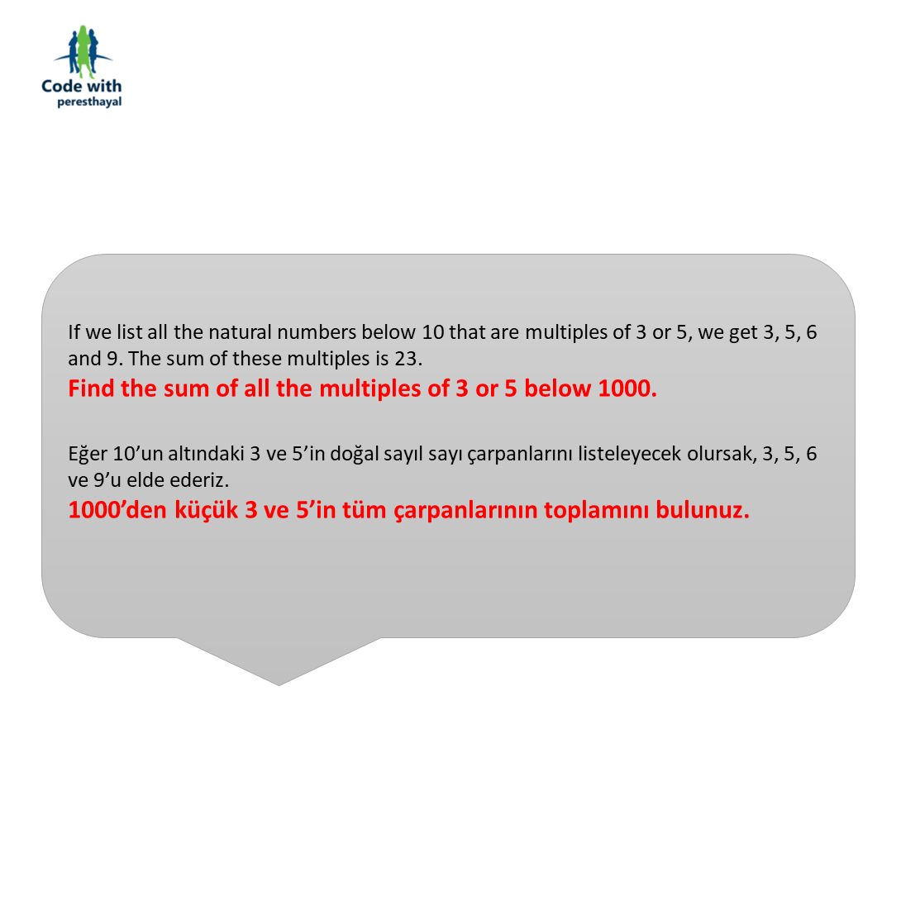
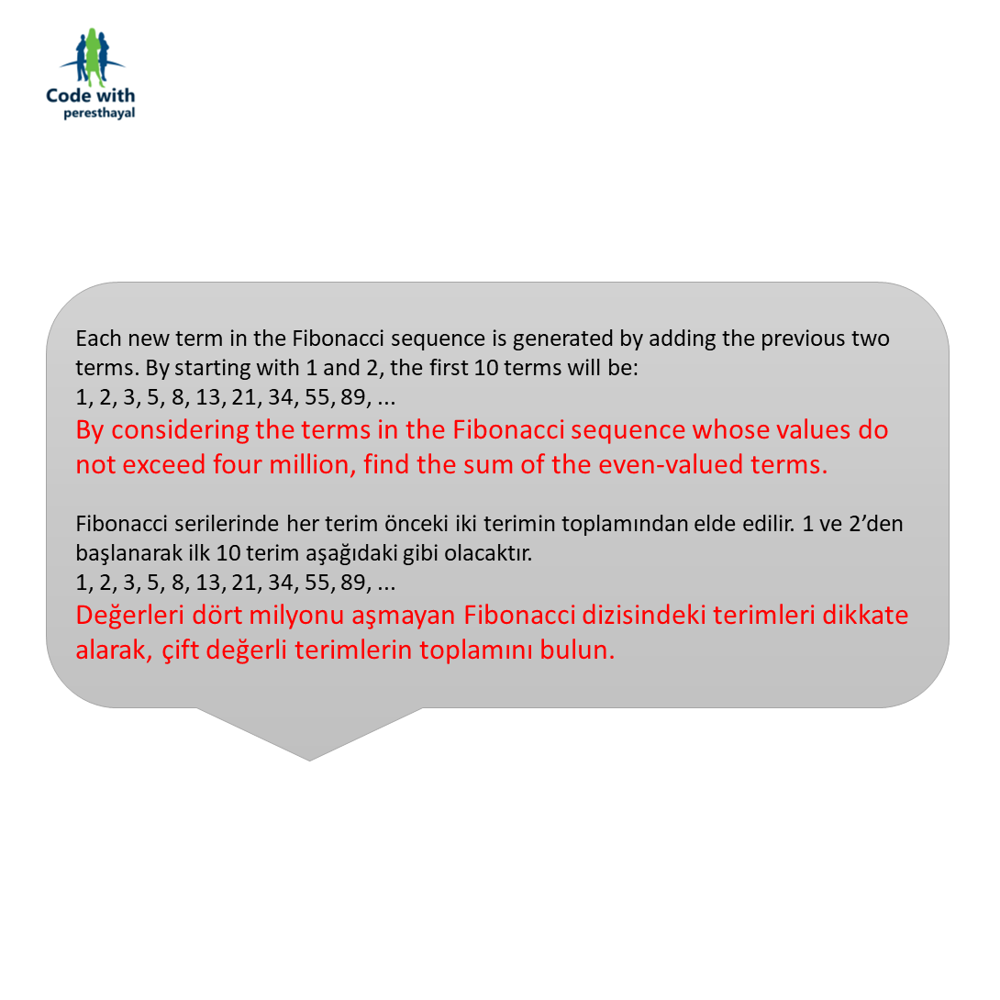
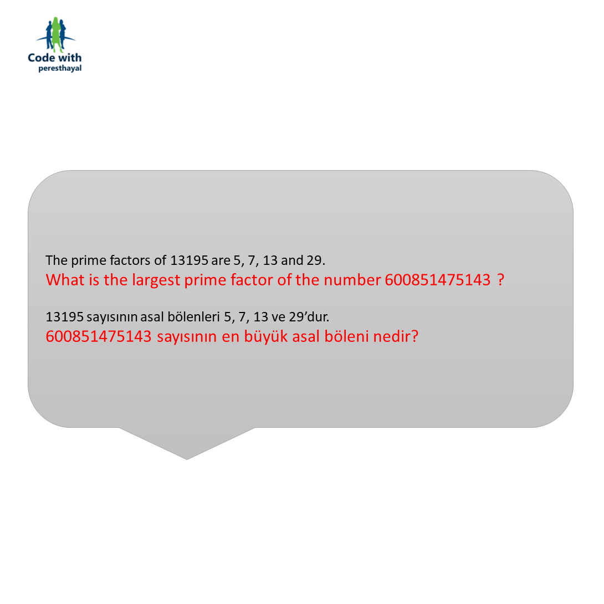

# Projelerle Kodluyorum
## Instagram : @codewithperesthayal

**Versiyon	:**  1.0 					 
**Lisans  	:**  Genel Kamu Lisansı      
**Contributors  :**  Burak Büyükyüksel	 

## Nedir?

Günümüzün en popüler dillerinden biri olarak kabul edilen
Python programa dili ile "Bir soru, bir cevap" şeklinde bir ambiyans oluşturacağız.. 

Problem çözümleri, sizden gelen sorular ve küçük programcıklarla dolu bir ortam.

İçerikleri @codewithperesthayal <a href="https://www.instagram.com/codewithperesthayal/">@codewithperesthayal</a> sayfasından paylaşacağım.
Kaynak kodlara doğrudan erişim için biyografide belirtilen linki kullanabilirsiniz.. 

## Şuanki içerikler;
### Problemler
* <i>Problems.1</i> : 3 ve 5'in Çarpanları
* <i>Problems.2</i> : Çift Fibonacci Sayıları
* <i>Problems.3</i> : En Büyük Asal Bölen
* <i>Problems.4</i> : 2 Adet 3 Haneli Sayı Çarpımlarının En Büyük Palindrom Sayısı
* <i>Problems.5</i> : Çarpanların En Küçüğü
* <i>Problems.6</i> : Toplam Kare Farkı
* <i>Problems.7</i> : 10001. Asal
* <i>Problems.8</i> : Dizideki En Büyük Çarpan

### Projeler
* <i>Project.1.DownloadFromYoutube</i> : Youtube Video İndirici

## Örnek İçerikler;

* Videolarınızdan sesin ayrı bir dosyaya çıkartılması.
* Sosyal medya paylaşımlarınızda düzinelerce fotoğraflarınızı kırpmamak üzere otomatik kare haline getirme.
* İnstagram için bot ve takipçi ön izleme.
* WEB sitelerinde otomatik form doldurma.
* Normal dağılım ile pi sayısının hesaplanması.
* Klasördeki .txt belgelerinin .pdf’e çevrilmesi.
* Klasörde bulunan dosyalarınızın belirlediğiniz uzantıya göre .zip’lenmesi.
* Facebook üzerinden .txt belgesine yazdığınız isim listesine toplu mesaj gönderimi.

<table>
	<tr>
		<th colspan=3> <b> Uygulama İçerisinden </b> </th>	
	</tr>
	<tr>
		<td> </td>
		<td> </td>
		<td> </td>
	</tr>
	<tr>
		<td> </td>
	</tr>
	
</table>

## Değişiklikler

### 1.0
* Yayımlanma : Nisan 25, 2020

Initial release